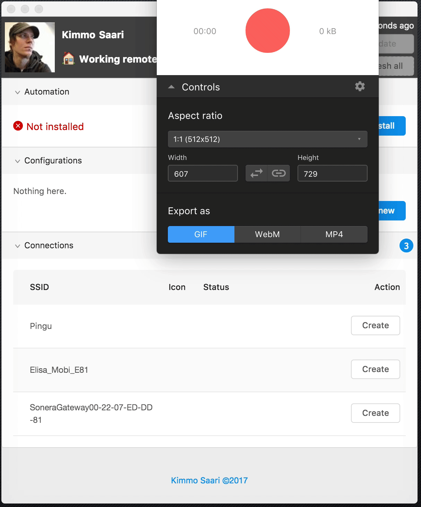

# Sloth

Set your Slack status based on the (B)SSID you're currently connected in.
You don't need to leave this app open, if you install the automation by clicking the [`Install` button here](#automation).
The automation is executed every 5 minutes.

## Downloads

### Desktop GUI application

Releases of the Desktop version can be [found here](https://github.com/sc5/sloth/releases).
Currently only Mac version is available, but in the future I intend to do a Windows version as well.

### Old Command Line Interface version

Old CLI version can be [found here](https://github.com/sc5/sloth/tree/cli).

## Main dependencies

* [Electron](https://github.com/electron/electron)
* [React](https://github.com/facebook/react)
* [Ant-design](https://ant.design/docs/react/introduce)
* [Less](https://github.com/less/less.js)
* [Socket.io](https://github.com/socketio/socket.io/)
* [Express](https://github.com/expressjs/express)
* [Slack](https://github.com/smallwins/slack)
* [node-wifi](https://github.com/elqui-app/node-wifi)
* [node-emoji](https://github.com/omnidan/node-emoji)
* [Font Awesome](https://github.com/FortAwesome/Font-Awesome)
* [Babel](https://github.com/babel/babel)
* [Webpack](https://github.com/webpack/webpack)
* [Eslint](https://github.com/eslint/eslint)
* [Airbnb JavaScript Style Guide](https://github.com/airbnb/javascript)

## What is done:

* Configure settings for WiFi connections
* Automate the updating
* Ability to create configurations based on `SSID` or `BSSID`
  * If you set only `SSID`, that configuration is used for every connection with the same name
  * If you set `BSSID`, that configuration is used only for that specific WiFi access point (this enables you to specify different configurations for different WiFi access points, for example if you have same SSID name across all the offices, you can create configurations for each office)
* Semiautomatic updates for the app

## Screenshots

### Authorisation

### Automation

### Configuring

